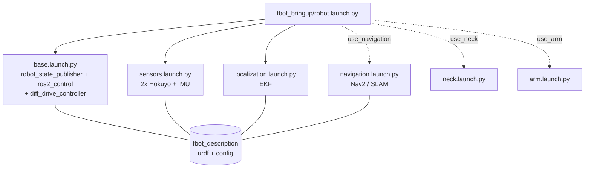

<div align="center">


<br>


**ROS 2 robot description packages for BORIS and related platforms in RoboCup@Home competitions**

[Overview](#overview) • [Architecture](#architecture) • [Installation](#installation) • [Usage](#usage) • [Development](#development)

</div>

---

## Overview

`fbot_description` is the **model of BORIS**: URDF/xacro of the base, body, neck and sensors, the meshes, and the configuration that describes the hardware (base geometry, controllers, EKF, footprint, sensor drivers). It is a single ROS 2 package at the root of this repository.

It contains **no bringup logic**: the robot is started from [`fbot_bringup`](https://github.com/fbotathome/fbot_bringup) with `robot.launch.py`.

**Glossary:** *BORIS* is the robot. *Shark* is its hoverboard differential-drive base (`base_version` = which Shark). The *neck* carries the camera.

---

## Quick start

| I want to... | Command |
|---|---|
| view the model (no hardware) | `ros2 launch fbot_description display.launch.py` |
| ...the new base, without the neck | `ros2 launch fbot_description display.launch.py base_version:=v2 use_neck:=false` |
| drive the base only (hoverboard test) | `ros2 launch fbot_bringup base.launch.py` |
| start the robot body (base + lasers + IMU + EKF) | `ros2 launch fbot_bringup robot.launch.py` |
| ...with navigation on a map | `ros2 launch fbot_bringup robot.launch.py use_navigation:=true map_file:=lab_2026_2.yaml` |
| ...mapping (SLAM) | `ros2 launch fbot_bringup robot.launch.py use_navigation:=true use_slam:=true` |
| ...with the neck / the arm | `... use_neck:=true` / `... use_arm:=true` |
| run a competition task | `ros2 launch fbot_behavior <task>.launch.py` (includes `robot.launch.py`) |
| check the model after editing a xacro | `colcon test --packages-select fbot_description` |

---

## Package layout

```
fbot_description/
├── urdf/
│   ├── boris.urdf.xacro        the robot (start here)
│   ├── body.xacro              torso, arm mounting plate, IMU frame
│   ├── base/                   Shark base: base.xacro (macro fbot_base), base_ros2_control.xacro, materials.xacro
│   ├── neck/neck.xacro         neck + camera mount (joints driven by fbot_head neck_controller)
│   └── sensors/                hokuyo.xacro, sick_lms1xx.xacro
├── config/
│   ├── base/v1.yaml, v2.yaml   base geometry: wheel radius/separation, size, driver port   <- ONLY place
│   ├── boris_controllers.yaml  diff_drive_controller (limits, rates)
│   ├── ekf.yaml                robot_localization (owner of odom -> base_footprint)
│   ├── footprint.yaml          Nav2 robot footprint
│   └── sensors/                Hokuyo and BNO055 driver parameters
├── meshes/{neck,sensors,face}/ face meshes are used by fbot_simulation only
├── launch/display.launch.py    model in RViz with joint sliders
├── rviz/boris.rviz
├── test/test_urdf.py           model checks for every flag combination
├── docs/                       adding hardware, calibration
└── legacy/                     old packages, NOT built (see legacy/README.md)
```

### xacro arguments (`urdf/boris.urdf.xacro`)

| Argument | Default | Meaning |
|---|---|---|
| `base_version` | `v1` | which `config/base/<v>.yaml` describes the base |
| `use_neck` | `true` | neck + camera mount (`camera_link`, `camera_link_static`) |
| `use_sick` | `true` | Sick LMS mount (`sick_mount_link`, `sick_laser`) |
| `use_arm_mount` | `false` | empty plate an arm can be attached to (`arm_mount_link`) |
| `arm_z_position` | `0.34` | height of that plate on the torso [m] |

`fbot_bringup/robot.launch.py` sets them from its own flags (`use_arm` -> `use_arm_mount`).

---

## How it fits together



```
/cmd_vel -> diff_drive_controller -> hoverboard_driver (ros2_control) -> /dev/ttySHARK -> motors
motors -> /odom --+
IMU -> /bno055/imu +-> EKF -> /odometry/filtered + TF odom -> base_footprint
```

TF tree:

```
map --(AMCL / slam_toolbox)--> odom --(EKF)--> base_footprint -> base_link
  base_link -> left_wheel, right_wheel, hokuyo_ground_link, hokuyo_back_link, sick_mount_link, imu_link
  base_link -> dorso_link -> neck_pan_link -> camera_mount_link -> camera_link        (moves with the neck)
                          \-> neck_pan_link_static -> ... -> camera_link_static         (fixed reference)
                          \-> arm_mount_link                                            (use_arm_mount)
```

Single owners: `/joint_states` comes only from `joint_state_publisher` (wheels from ros2_control + neck from `/boris_head/joint_states`); `odom -> base_footprint` only from the EKF.

### Where is X defined?

| What | File |
|---|---|
| wheel radius, wheel separation, base size, driver serial port | `config/base/<base_version>.yaml` |
| controller limits and rates | `config/boris_controllers.yaml` |
| EKF | `config/ekf.yaml` |
| Nav2 footprint | `config/footprint.yaml` |
| laser / IMU driver parameters | `config/sensors/` (IMU port: `imu_port` arg of `fbot_bringup/sensors.launch.py`) |
| sensor positions on the robot | `urdf/boris.urdf.xacro`, `urdf/body.xacro` |
| Nav2 / SLAM params, maps | `fbot_navigation/param`, `fbot_navigation/maps` |

More: [adding or changing hardware](docs/adding-hardware.md), [base versions and odometry calibration](docs/calibration.md).

---

## Migrating from the old packages

| Old | New |
|---|---|
| `boris_description` (launch + xacro) | `fbot_bringup/robot.launch.py`, `urdf/boris.urdf.xacro` |
| `shark_description` | `urdf/base/`, `config/base/<v>.yaml` |
| `boris_head_description` | `urdf/neck/neck.xacro`, `meshes/face/` |
| `sensors_description` | `urdf/sensors/`, `meshes/sensors/`, `config/sensors/`; drivers in `fbot_bringup/sensors.launch.py` |
| `package://sensors_description/meshes/<m>` | `package://fbot_description/meshes/{neck,sensors}/<m>` |
| `package://boris_head_description/meshes/dae/<m>` | `package://fbot_description/meshes/face/<m>` |

On a machine that built the old packages, remove their stale install folders once:
`rm -rf build/{boris,shark,sensors,boris_head,logistic}_description install/{boris,shark,sensors,boris_head,logistic}_description`

---

## Installation

```bash
cd ~/fbot_ws/src
git clone https://github.com/fbotathome/fbot_description.git
cd ~/fbot_ws
rosdep install --from-paths src --ignore-src -r -y
colcon build --packages-select fbot_description
source install/setup.bash
colcon test --packages-select fbot_description && colcon test-result --verbose
```

---

## Development

1. Create a feature branch (`git checkout -b feat/amazing-feature`)
2. Change the model under `urdf/`, `config/` or `meshes/` and run `colcon test --packages-select fbot_description`
3. Never add dimensions to more than one file: base geometry lives in `config/base/<v>.yaml`
4. Commit your changes (`git commit -m 'Add amazing feature'`)
5. Push to the branch (`git push origin feat/amazing-feature`)
6. Open a Pull Request

---
