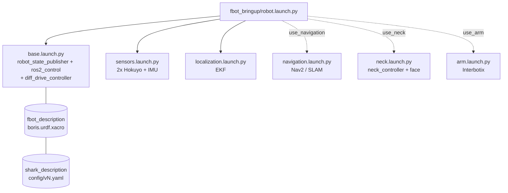

<div align="center">


<br>


**ROS 2 robot description packages for BORIS and related platforms in RoboCup@Home competitions**

[Overview](#overview) • [Architecture](#architecture) • [Installation](#installation) • [Usage](#usage) • [Development](#development)

</div>

---

## Overview

This repository holds the **description packages** of BORIS: URDF/xacro models, meshes, controller / EKF / sensor configuration. It contains **no bringup logic**: the robot is started from [`fbot_bringup`](../fbot_bringup) with a single launch, `robot.launch.py`.

---

## Quick start

```bash
# 1. look at the model, no hardware needed
ros2 launch fbot_description display.launch.py

# 2. start the robot body: base + lasers + IMU + EKF
ros2 launch fbot_bringup robot.launch.py

# 3. ...plus navigation on a map, neck/camera mount
ros2 launch fbot_bringup robot.launch.py use_navigation:=true map_file:=lab_2026_2.yaml use_neck:=true
```

| I want to...                         | Command |
|--------------------------------------|---------|
| view the model (RViz + joint sliders)| `ros2 launch fbot_description display.launch.py` |
| drive the base only (hoverboard test)| `ros2 launch fbot_bringup base.launch.py` |
| start the whole robot body           | `ros2 launch fbot_bringup robot.launch.py` |
| ...with navigation (AMCL + map)      | `... robot.launch.py use_navigation:=true map_file:=<map>.yaml` |
| ...mapping / navigating with SLAM    | `... robot.launch.py use_navigation:=true use_slam:=true` |
| ...with the neck + camera mount      | `... robot.launch.py use_neck:=true` |
| ...with the Interbotix arm (optional)| `... robot.launch.py use_arm:=true` |
| use the new Shark base               | `... robot.launch.py base_version:=v2` |
| run a competition task               | `ros2 launch fbot_behavior <task>.launch.py` (it includes `robot.launch.py`) |

Task launches in `fbot_behavior` must include `robot.launch.py` **once** instead of separate description / navigation / neck launches.

---

## Architecture

### What starts what



### Command and data flow

```
/cmd_vel -> diff_drive_controller (hoverboard_base_controller)
         -> hoverboard_driver (ros2_control plugin) -> /dev/ttySHARK -> motors
motors   -> hoverboard_driver -> /odom ----------+
IMU      -> /bno055/imu ----------------------- EKF -> /odometry/filtered + odom->base_footprint TF
```

### TF tree

```
map --(AMCL / slam_toolbox)--> odom --(EKF)--> base_footprint -> base_link
     base_link -> left_wheel, right_wheel, hokuyo_ground_link, hokuyo_back_link, sick_mount_link, imu_link
     base_link -> dorso_link -> neck_pan_link -> camera_mount_link -> camera_link   (use_neck; moves with the neck)
                            \-> neck_pan_link_static -> ... -> camera_link_static     (fixed reference)
                            \-> arm_mount_link                                       (use_arm_mount)
```

Single owners: `/joint_states` is published only by `joint_state_publisher` (merging the wheels from `ros2_control` and the neck from `/boris_head/joint_states`); `odom -> base_footprint` only by the EKF.

### Packages in this repository

| Package | Role |
|---------|------|
| `fbot_description`      | **BORIS model**: `urdf/boris.urdf.xacro`, `config/` (controllers, EKF, footprint, sensor params), `launch/display.launch.py` |
| `shark_description`     | Differential-drive **base**: one macro, geometry from `config/<base_version>.yaml` |
| `boris_head_description`| **Neck + camera mount** macro (joints match `fbot_head` `neck_controller`) |
| `sensors_description`   | Sensor macros (Hokuyo, Sick, ...), meshes, sensor launch files |
| `logistic_description`  | Logistic robot variant (legacy, untouched) |
| `boris_description`     | **Deprecated** previous description + launch. Kept until every task uses `robot.launch.py` |

### Where is X defined?

| What | File |
|------|------|
| Wheel radius, wheel separation, base size, driver serial port | `shark_description/config/<base_version>.yaml` (**the only place**) |
| Diff-drive controller limits, rates | `fbot_description/config/boris_controllers.yaml` |
| EKF (odometry + IMU fusion) | `fbot_description/config/ekf.yaml` |
| Nav2 robot footprint | `fbot_description/config/footprint.yaml` |
| Laser / IMU driver parameters | `fbot_description/config/sensors/` |
| IMU serial port | `imu_port` argument of `fbot_bringup/sensors.launch.py` |
| Body, sensor mounting positions | `fbot_description/urdf/boris_body.xacro`, `boris.urdf.xacro` |
| Neck + camera mount | `boris_head_description/urdf/neck.xacro` |
| Nav2 / SLAM parameters, maps | `fbot_navigation/param`, `fbot_navigation/maps` |

### Base versions and odometry calibration

The robot base is chosen with `base_version:=v1|v2`. Each version is a yaml file in `shark_description/config/`. The same file feeds the URDF (wheel positions and sizes), the `ros2_control` block, and the controller's `wheel_radius` / `wheel_separation` (merged in `base.launch.py`), so they can never disagree.

**`v2` still holds the v1 numbers** (placeholder): measure the new base and edit `config/v2.yaml` before using it.

Odometry scale depends on `wheel.radius` and `wheel.separation`. Calibrate after any hardware change:

1. Robot on the floor, `robot.launch.py` running. Mark 2 m on the floor and drive it with a slow `/cmd_vel` (0.2 m/s).
2. Compare the distance in `/odom` to the tape measure: `radius_new = radius_old * real / odom`.
3. Spin 360 degrees in place and compare the yaw: `separation_new = separation_old * odom_yaw / real_yaw`.
4. Edit the values in `config/<version>.yaml` and repeat until the error is small.

### Adding or changing hardware

- **New sensor**: add its macro to `sensors_description`, instantiate it in `fbot_description/urdf/boris.urdf.xacro`, then start its driver in `fbot_bringup/launch/sensors.launch.py`. The driver's `frame_id` must be the URDF link name.
- **Arm**: not part of the body any more; `use_arm:=true` adds an empty mounting plate and starts `arm.launch.py`.

---

## Installation

### Prerequisites

- ROS 2 Humble, Ubuntu 22.04, Python 3.10+

### Setup

```bash
cd ~/fbot_ws/src
git clone <this-repo-url>
cd ~/fbot_ws
rosdep update
rosdep install --from-paths src --ignore-src -r -y
pip install -r src/fbot_description/sensors_description/requirements.txt   # sensors_description only

colcon build --packages-select fbot_description shark_description boris_head_description sensors_description
source install/setup.bash
```

Check the model after any xacro change:

```bash
xacro $(ros2 pkg prefix fbot_description)/share/fbot_description/urdf/boris.urdf.xacro base_version:=v1 | check_urdf /dev/stdin
```

---

## Development

1. Create a feature branch (`git checkout -b feat/amazing-feature`)
2. Add or modify URDF/Xacro, meshes, configs, or launch files in the appropriate package
3. Update `package.xml` and `CMakeLists.txt` if needed
4. Commit your changes (`git commit -m 'Add amazing feature'`)
5. Push to the branch (`git push origin feat/amazing-feature`)
6. Open a Pull Request

---
